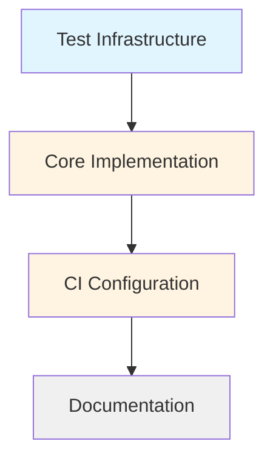

# Tasks

## Task Lifecycle

**Task files are temporary.** When a task is complete:
1. Ensure implementation is documented in README.md or CLAUDE.md
2. Delete the task file
3. Mark task complete in this README

The `tasks/` directory should trend toward empty as work completes.

---

**Sequential**: Test Infrastructure → Core Implementation → CI Configuration → Documentation

Tests define the contract, implementation satisfies it, CI enforces it.

---

## Test Infrastructure

- [ ] Test harness and fixtures - [details](./test-infrastructure.md)
- [ ] End-to-end test cases - [details](./e2e-testing.md)

---

## Core Implementation

- [ ] `tsconfig.json` - [details](./typescript-config.md)
- [ ] `.claude-plugin/plugin.json` - [details](./plugin-manifest.md)
- [ ] `hooks/hooks.json` - [details](./hooks-configuration.md)
- [ ] `hook.ts` - [details](./hook-implementation.md)

---

## CI Configuration

- [ ] GitHub Actions workflow - [details](./github-actions.md)

---

## Documentation

- [ ] Update `README.md` - [details](./documentation.md)
